# UW5 Singularity Engine v2 — System Architecture

> **Author:** cagdas
> **Version:** v2 (Singularity)
> **Pipeline:** 15-layer autonomous • Crash-proof • Cross-platform • Multi-agent • Self-healing

---

## Mermaid Architecture Diagram

```mermaid
%%{init: {'theme': 'base', 'themeVariables': { 'background': '#0d1117', 'primaryColor': '#1f2937', 'secondaryColor': '#374151', 'tertiaryColor': '#4b5563', 'primaryTextColor': '#f3f4f6', 'secondaryTextColor': '#d1d5db', 'lineColor': '#6b7280', 'fontSize': '12px'}}}%%

graph TB
    %% ─── STYLE DEFINITIONS ───
    classDef init fill:#1a3a2a,stroke:#2ecc71,stroke-width:2,color:#a8e6cf
    classDef pipeline fill:#1a2a3a,stroke:#3498db,stroke-width:2,color:#a8d8ea
    classDef healing fill:#3a1a1a,stroke:#e74c3c,stroke-width:2,color:#f5b7b1
    classDef event fill:#2a1a3a,stroke:#9b59b6,stroke-width:2,color:#d7bde2
    classDef nexus fill:#1a2a1a,stroke:#27ae60,stroke-width:2,color:#a9dfbf
    classDef provider fill:#2a2a1a,stroke:#f39c12,stroke-width:2,color:#f9e79f
    classDef memory fill:#1a1a3a,stroke:#e67e22,stroke-width:2,color:#f5cba7
    classDef tool_layer fill:#2a1a1a,stroke:#e74c3c,stroke-width:2,color:#f1948a
    classDef gateway fill:#1a1a1a,stroke:#95a5a6,stroke-width:3,color:#ecf0f1
    classDef subgraph_style fill:#111827,stroke:#374151,stroke-width:1,color:#9ca3af

    %% ─── GATEWAY / ENTRY ───
    GATEWAY["🚪 UW5 GATEWAY<br/><i>/uw5 &lt;task&gt;</i>"]:::gateway
    INTENT["🧠 INTENT DETECTOR<br/>Auto-Routing Logic"]:::gateway

    GATEWAY --> INTENT

    %% ─── SECTION 1: INIT SESSION ───
    subgraph INIT["🟢 INIT SESSION (Automatic on Startup)"]
        direction TB
        START["🚀 OpenCode START"]:::init
        S1["1️⃣ CONFIG VALIDATOR<br/>opencode.jsonc + AGENTS.md"]:::init
        S2["2️⃣ API VALIDATOR<br/>Groq · Gemini · OpenRouter"]:::init
        S3["3️⃣ HEALTH CHECK<br/>CPU · RAM · Disk · Network"]:::init
        S4["4️⃣ PROJECT INDEXER<br/>Repo scan · Dependency graph"]:::init
        S5["5️⃣ CONTEXT ENGINE<br/>Load active context (≤24h)"]:::init
        S6["6️⃣ MEMORY ENGINE<br/>Load conversation/project mem"]:::init
        S7["7️⃣ CRASH RECOVERY<br/>Golden state restore if needed"]:::init
        S8["8️⃣ CONTEXT GUARD<br/>Start background monitor"]:::init
        START --> S1 --> S2 --> S3 --> S4 --> S5 --> S6 --> S7 --> S8
    end

    INTENT --> INIT
    INIT -->|"Ready"| PIPELINE_START

    %% ─── SECTION 2: TASK PIPELINE (15 Layers) ───
    subgraph PIPELINE["🔵 TASK PIPELINE — 15 Katman (her /uw5 &lt;task&gt;)"]
        direction TB

        L00["00 🔵 CONTEXT GUARD<br/>10+ turns / 15K+ token → silent compact"]:::pipeline
        L01["01 📋 TASK PLANNER<br/>Goal analysis → Task breakdown → Dependency planning"]:::pipeline
        L02["02 🧠 KAIROS RECALL<br/>Past memory → Similar domain/intent → Previous solution"]:::pipeline
        L03["03 🔍 CAPABILITY MATRIX<br/>Required skills → Tools → Context → Workspace size"]:::pipeline
        L04["04 💰 COST OPTIMIZER<br/>Token estimate → Speed/quality score → Tier selection"]:::pipeline
        L05["05 🎯 MODEL ROUTER<br/>FLASH/Groq · BALANCED/Gemini · DEEP/GPT-4o · ULTRA/Claude"]:::pipeline
        L06["06 📦 SKILL AUTO-LOAD<br/>Skill matrix scan → 130+ matching skills load"]:::pipeline
        L07["07 🔧 TOOL REGISTRY<br/>Git · Docker · Node · Python · Browser · SQLite"]:::pipeline
        L08["08 🧩 PLUGIN MANAGER<br/>Trading · Android · iOS · AI · Custom plugins"]:::pipeline
        L09["09 ⚙️ PROMPT COMPILER<br/>System prompt + AGENTS.md + Skill + Memory + Task"]:::pipeline
        L10["10 🤖 MULTI-AGENT ORCHESTRATOR<br/>Master → Coding → UI → Backend → Test → Review → Docs"]:::pipeline
        L11["11 🚀 EXECUTION ENGINE<br/>Parallel/Sequential → Tool calls → Agent coordination"]:::pipeline
        L12["12 ✅ VERIFIER + REVIEW<br/>Compile · Lint · Test · AI Review · Security · Perf"]:::pipeline
        L13["13 🔄 SELF-HEALING LOOP<br/>FAIL? → Patch → Verify → Retry → PASS"]:::pipeline
        L14["14 🟡 GOLDEN STATE ENGINE<br/>Save state → Save memory → Rotate backup → Clear crash"]:::pipeline

        L00 --> L01 --> L02 --> L03 --> L04 --> L05 --> L06 --> L07 --> L08 --> L09 --> L10 --> L11 --> L12 --> L13 --> L14
    end

    PIPELINE_START[("▶️ Pipeline Start")]:::pipeline
    PIPELINE_START --> L00
    L14 --> OUTPUT[("✅ Task Complete")]:::pipeline

    %% ─── SECTION 3: SELF-HEALING LOOP ───
    subgraph HEALING["🔄 SELF-HEALING LOOP (Error Recovery)"]
        direction TB
        HP["📐 PLAN"]:::healing
        HE["⚡ EXECUTE"]:::healing
        HV["🔍 VERIFY"]:::healing
        HR["👁️ REVIEW"]:::healing
        HD{"PASS?"}:::healing
        HC["✅ CONTINUE"]:::healing
        HF["❌ FAIL (×3 attempts)"]:::healing
        HPATCH["🩹 PATCH"]:::healing
        HRETRY["🔄 RETRY"]:::healing
        HVERIFY2["🔍 VERIFY (retry)"]:::healing
        HD2{"PASS?"}:::healing
        HFALLBACK["⚠️ FALLBACK → Report"]:::healing

        HP --> HE --> HV --> HR --> HD
        HD -->|"YES"| HC
        HD -->|"NO"| HPATCH --> HRETRY --> HVERIFY2 --> HD2
        HD2 -->|"YES"| HC
        HD2 -->|"NO (×3)"| HF
    end

    HEALING_ERROR_TRIGGER["⚠️ Any Pipeline Step FAIL"]:::healing
    HEALING_ERROR_TRIGGER --> HP
    L12 -.->|"on verify fail"| HEALING_ERROR_TRIGGER
    L13 -.->|"healing pass"| L14

    %% ─── SECTION 4: EVENT BUS ───
    subgraph EVENTS["📡 EVENT BUS / HOOKS (10 Events)"]
        direction TB
        E1["on_session_start<br/>Init session + config validate"]:::event
        E2["on_task_before<br/>Context guard + memory recall"]:::event
        E3["on_task_after<br/>Golden state + kairos record"]:::event
        E4["on_edit_before<br/>Auto backup"]:::event
        E5["on_edit_after<br/>Diff review + quality gate"]:::event
        E6["on_commit_before<br/>Lint + test + security scan"]:::event
        E7["on_commit_after<br/>Changelog + golden state"]:::event
        E8["on_crash<br/>Crash flag + golden state restore"]:::event
        E9["on_recovery<br/>Context reconfiguration"]:::event
        E10["on_shutdown<br/>Final golden state + log"]:::event
    end

    PIPELINE -.->|"fires events"| EVENTS

    %% ─── SECTION 5: NEXUS DOMAIN AGENTS ───
    subgraph NEXUS["🧬 NEXUS DOMAIN AGENTS (Auto-Detect)"]
        direction TB
        N1["🌲 pine-architect<br/>Pine Script · TradingView"]:::nexus
        N2["🤖 ai-systems-architect<br/>NPC · Microservice · MCP · FastAPI"]:::nexus
        N3["🎨 web-artifact-forge<br/>Three.js · GLSL · Cinematic Web"]:::nexus
        N4["📱 ios-swift-architect<br/>Swift · AVFoundation · Core ML"]:::nexus
        N5["🖼️ visual-pipeline-ops<br/>ComfyUI · Flux · SDXL · VRAM"]:::nexus
        N6["🔍 explore<br/>Codebase discovery · File search"]:::nexus
        N7["📋 plan-reviewer<br/>Architecture · Risk analysis"]:::nexus
        N8["🌐 universal-orchestrator<br/>Default · All skills scanned"]:::nexus
    end

    L06 -.->|"skill matched"| NEXUS

    %% ─── SECTION 6: PROVIDER LAYER ───
    subgraph PROVIDERS["🧠 REASONING TIERS / PROVIDERS"]
        direction TB
        P1["⚡ FLASH — Groq Llama 3.3 70B<br/>320 tok/s · Simple tasks · Quick search"]:::provider
        P2["⚖️ BALANCED — Google Gemini 2.5 Flash<br/>1M context · Turkish · Refactor · Reasoning"]:::provider
        P3["🔬 DEEP — OpenRouter GPT-4o<br/>Complex analysis · Strategy · Optimization"]:::provider
        P4["💎 ULTRA — Claude Sonnet 4.6<br/>Maximum intelligence · Critical decisions"]:::provider
        P5["🏠 LOCAL — Ollama Qwen 2.5 Coder 7B<br/>Privacy · Offline · No cost"]:::provider
        P6["📴 OFFLINE — Ollama Llama 3.2 3B<br/>Fully offline · Tiny model"]:::provider
    end

    L05 -->|"route to"| PROVIDERS

    %% ─── SECTION 7: MEMORY LAYER ───
    subgraph MEMORY["💾 MEMORY & STATE LAYER (3-Tier Protection)"]
        direction TB
        M1["🟡 GOLDEN STATE<br/>~/.config/opencode/.golden-state/<br/>Last 10 backups · Crash recovery"]:::memory
        M2["📝 active-context.md<br/>Per-session · Task/file/decision/progress"]:::memory
        M3["📓 Obsidian Vault<br/>OpenCode Sessions Archive"]:::memory
        M4["🔴 KAIROS ENGINE<br/>Error signatures · Domain memory · Dream consolidation"]:::memory
        M5["💡 Knowledge Base<br/>~/.claude/knowledge/ · Categories"]:::memory
        M6["📸 Snapshot System<br/>.uw5-snapshots/ · sna-*.ps1"]:::memory
    end

    L02 -->|"query"| MEMORY
    L14 -->|"save to"| MEMORY

    %% ─── SECTION 8: TOOL LAYER ───
    subgraph TOOLS["🔧 TOOL & SKILL LAYER"]
        direction TB
        T1["🐙 Git · GitHub · Release"]:::tool_layer
        T2["🐳 Docker · Containers"]:::tool_layer
        T3["🟩 Node.js · npm · n8n"]:::tool_layer
        T4["🐍 Python · pip · FastAPI"]:::tool_layer
        T5["🌐 Browser Use · Web Scraping"]:::tool_layer
        T6["☁️ Azure Cloud (29 skills)"]:::tool_layer
        T7["🎯 Trading · Pine Script · Backtest"]:::tool_layer
        T8["🎮 Game Dev · UE5 · AAA Studio"]:::tool_layer
        T9["📦 Laravel · PHP · Livewire"]:::tool_layer
        T10["🧪 Sentry · Monitoring · Debug"]:::tool_layer
        T11["🔌 30+ MCP Servers"]:::tool_layer
        T12["📚 130+ Skills (Auto-Load Matrix)"]:::tool_layer
    end

    L07 -->|"register"| TOOLS
    L08 -->|"manage"| TOOLS

    %% ─── CROSS-CONNECTIONS ───
    L10 -.->|"spawns"| NEXUS
    L11 -.->|"uses"| TOOLS
    L09 -.->|"reads"| MEMORY
    L12 -.->|"reports to"| EVENTS

    %% ─── COMMAND SHORTCUTS ───
    subgraph COMMANDS["📋 COMMAND REFERENCE"]
        direction TB
        CMD1["/uw5 &lt;task&gt; · /uw5flash · /uw5deep<br/>/uw5ultra · /uw5local · /uw5offline"]:::gateway
        CMD2["/uw5 swarm · /uw5 ooda · /uw5 test<br/>/uw5 quality · /uw5 doctor · /uw5 health"]:::gateway
        CMD3["/uw5 memory · /uw5 compact · /uw5 dream<br/>/uw5 evolve · /uw5 index · /uw5 graph"]:::gateway
        CMD4["/uw5 backup · /uw5 restore · /uw5 clean<br/>/uw5 audit · /uw5 cost · /uw5 cache"]:::gateway
        CMD5["/uw5 knowledge · /uw5 vault<br/>/uw5 site · /uw5 gorsel · /uw5 animate"]:::gateway
        CMD6["/snap · /review · /scan · /build<br/>/save-memory · /load-memory · /compact"]:::gateway
    end

    GATEWAY -.-> COMMANDS
```



---

## ASCII Architecture Schematic

```
╔══════════════════════════════════════════════════════════════════════════════╗
║            UW5 SINGULARITY ENGINE v2 — SYSTEM ARCHITECTURE                 ║
║            Autonomous • Crash-Proof • Cross-Platform • Multi-Agent          ║
╚══════════════════════════════════════════════════════════════════════════════╝

┌─────────────────────────────────────────────────────────────────────────────┐
│  🚪 ENTRY GATEWAY                                                          │
│                                                                             │
│     /uw5 <task>  ──→  [INTENT DETECTOR]  ──→  Auto-Routing Logic           │
│                        ↑ 130+ keywords / 30+ intent patterns               │
└───────────────────────────────────┬─────────────────────────────────────────┘
                                    │
┌───────────────────────────────────▼─────────────────────────────────────────┐
│  🟢 1. INIT SESSION (Automatic on Startup)                                  │
│                                                                             │
│     ┌──────────┐    ┌──────────┐    ┌──────────┐    ┌──────────┐          │
│     │ CONFIG   │──→ │   API    │──→ │  HEALTH  │──→ │ PROJECT  │          │
│     │VALIDATOR │    │VALIDATOR │    │  CHECK   │    │ INDEXER  │          │
│     └──────────┘    └──────────┘    └──────────┘    └──────────┘          │
│          │               │               │               │                  │
│          ▼               ▼               ▼               ▼                  │
│     ┌──────────┐    ┌──────────┐    ┌──────────┐    ┌──────────┐          │
│     │ CONTEXT  │──→ │  MEMORY  │──→ │  CRASH   │──→ │ CONTEXT  │          │
│     │  ENGINE  │    │  ENGINE  │    │ RECOVERY │    │  GUARD   │──→ Ready │
│     └──────────┘    └──────────┘    └──────────┘    └──────────┘          │
└───────────────────────────────────┬─────────────────────────────────────────┘
                                    │
┌───────────────────────────────────▼─────────────────────────────────────────┐
│  🔵 2. TASK PIPELINE — 15 Katman (her /uw5 <task>)                        │
│                                                                             │
│  00: [CONTEXT GUARD]       10+ turns / 15K+ token → silent compact         │
│       │                                                                     │
│  01: [TASK PLANNER]        Goal analysis → Task breakdown → Dependencies    │
│       │                                                                     │
│  02: [KAIROS RECALL]       Past memory → Similar intent → Prior solution    │
│       │ ←─── 💾 Memory Layer ───┐                                          │
│  03: [CAPABILITY MATRIX]    Skills → Tools → Context → Workspace size       │
│       │                                                                     │
│  04: [COST OPTIMIZER]       Token estimate → Speed/Quality → Tier select    │
│       │                                                                     │
│  05: [MODEL ROUTER]         FLASH/BALANCED/DEEP/ULTRA/LOCAL/OFFLINE         │
│       │ ←─── 🧠 Provider Layer ───┐                                        │
│  06: [SKILL AUTO-LOAD]      130+ skills scanned → Matching skills loaded    │
│       │ ←─── 🧬 NEXUS Agents ───┐                                          │
│  07: [TOOL REGISTRY]        Git/Docker/Node/Python/Browser/SQLite/...       │
│       │                                                                     │
│  08: [PLUGIN MANAGER]       Trading/Android/iOS/AI/Custom plugins           │
│       │                                                                     │
│  09: [PROMPT COMPILER]      System + AGENTS.md + Skill + Memory + Task      │
│       │                                                                     │
│  10: [MULTI-AGENT ORCH.]    Master → Coding → UI → Backend → Test/Docs      │
│       │                                                                     │
│  11: [EXECUTION ENGINE]     Parallel/Sequential → Tool calls → Coordination │
│       │                                                                     │
│  12: [VERIFIER + REVIEW]    Compile/Lint/Test/AI Review/Security/Perf       │
│       │                      (fires 📡 Event Bus hooks)                     │
│  13: [SELF-HEALING LOOP]    FAIL? → Patch → Verify → Retry → PASS          │
│       │                      (3 attempts → fallback)                        │
│  14: [GOLDEN STATE ENGINE]  Save state → Save memory → Rotate → Clear       │
│       │ ←─── 💾 Memory Layer ───┐                                          │
│       ▼                                                                     │
│  ✅ TASK COMPLETE                                                           │
└───────────────────────────────────┬─────────────────────────────────────────┘
                                    │
┌───────────────────────────────────▼─────────────────────────────────────────┐
│  🔄 3. SELF-HEALING LOOP (Error Recovery Subsystem)                        │
│                                                                             │
│     PLAN ─→ EXECUTE ─→ VERIFY ─→ REVIEW ─→ PASS? ──→ CONTINUE              │
│                                              │                              │
│                                             NO│                             │
│                                               ▼                             │
│                                         ┌──────────┐                       │
│                                         │  PATCH   │──→ RETRY ─→ VERIFY    │
│                                         └──────────┘         │              │
│                                                          PASS? ──→ CONTINUE │
│                                                            │                │
│                                                           NO│ (×3)          │
│                                                             ▼               │
│                                                    ❌ FAIL → FALLBACK       │
│                                                                             │
│     • All errors saved to KAIROS with error_signature                       │
│     • Fallback strategy applied after 3 failed attempts                     │
└─────────────────────────────────────────────────────────────────────────────┘

┌─────────────────────────────────────────────────────────────────────────────┐
│  📡 4. EVENT BUS / HOOKS (10 Lifecycle Events)                              │
│                                                                             │
│  ┌──────────────────┬──────────────────┬──────────────────┐                │
│  │ on_session_start │ on_task_before   │ on_task_after    │                │
│  │ Init + validate  │ Context+memory   │ Golden+kairos    │                │
│  ├──────────────────┼──────────────────┼──────────────────┤                │
│  │ on_edit_before   │ on_edit_after    │ on_commit_before │                │
│  │ Auto backup      │ Diff+quality     │ Lint+test+sec    │                │
│  ├──────────────────┼──────────────────┼──────────────────┤                │
│  │ on_commit_after  │ on_crash         │ on_recovery      │                │
│  │ Changelog+golden │ Flag+restore     │ Reconfigure      │                │
│  ├──────────────────┼──────────────────┼──────────────────┤                │
│  │ on_shutdown      │                  │                  │                │
│  │ Final state+log  │                  │                  │                │
│  └──────────────────┴──────────────────┴──────────────────┘                │
└─────────────────────────────────────────────────────────────────────────────┘

┌─────────────────────────────────────────────────────────────────────────────┐
│  🧬 5. NEXUS DOMAIN AGENTS (Intent → Agent Auto-Detect)                    │
│                                                                             │
│     ┌──────────────────┐   ┌──────────────────┐   ┌──────────────────┐     │
│     │ pine-architect   │   │ai-systems-       │   │ web-artifact-    │     │
│     │ Pine Script      │   │architect         │   │ forge            │     │
│     │ TradingView      │   │ NPC/MCP/FastAPI  │   │ Three.js/GLSL    │     │
│     └──────────────────┘   └──────────────────┘   └──────────────────┘     │
│     ┌──────────────────┐   ┌──────────────────┐   ┌──────────────────┐     │
│     │ ios-swift-       │   │ visual-pipeline- │   │ explore          │     │
│     │ architect        │   │ ops              │   │ Codebase search  │     │
│     │ Swift/Core ML    │   │ ComfyUI/Flux     │   │ File discovery   │     │
│     └──────────────────┘   └──────────────────┘   └──────────────────┘     │
│     ┌──────────────────┐   ┌──────────────────┐                             │
│     │ plan-reviewer    │   │ universal-       │                             │
│     │ Arch/Risk review │   │ orchestrator     │                             │
│     │ Read-only        │   │ Default/All      │                             │
│     └──────────────────┘   └──────────────────┘                             │
└─────────────────────────────────────────────────────────────────────────────┘

┌─────────────────────────────────────────────────────────────────────────────┐
│  🧠 6. REASONING TIERS / PROVIDER LAYER                                     │
│                                                                             │
│  ⚡  FLASH    │ Groq Llama 3.3 70B    │ 320 tok/s  │ Simple tasks          │
│  ⚖️  BALANCED │ Google Gemini 2.5     │ 1M context │ Turkish/Refactor      │
│  🔬  DEEP     │ OpenRouter GPT-4o     │ Frontier   │ Complex analysis      │
│  💎  ULTRA    │ Claude Sonnet 4.6     │ Max IQ     │ Critical decisions    │
│  🏠  LOCAL    │ Ollama Qwen 2.5 7B    │ Offline    │ Privacy               │
│  📴  OFFLINE  │ Ollama Llama 3.2 3B   │ No net     │ Tiny model            │
│                                                                             │
│  Provider Priority: Google → Groq → OpenRouter → Ollama                     │
└─────────────────────────────────────────────────────────────────────────────┘

┌─────────────────────────────────────────────────────────────────────────────┐
│  💾 7. MEMORY & STATE LAYER (3-Tier Protection)                             │
│                                                                             │
│     ┌─────────────────────────────────────────────────────────────────┐    │
│     │  🟡 GOLDEN STATE (Last 10 Backups)                              │    │
│     │  ~/.config/opencode/.golden-state/                              │    │
│     │  Crash recovery · Task state · Golden snapshots                 │    │
│     └─────────────────────────────────────────────────────────────────┘    │
│     ┌──────────────────────────┐  ┌──────────────────────────────────┐    │
│     │  📝 active-context.md    │  │  📓 Obsidian Vault               │    │
│     │  Per-session state       │  │  OpenCode Sessions/ archive      │    │
│     │  Tasks/Files/Decisions   │  │  Long-term memory storage        │    │
│     └──────────────────────────┘  └──────────────────────────────────┘    │
│     ┌──────────────────────────┐  ┌──────────────────────────────────┐    │
│     │  🔴 KAIROS ENGINE        │  │  📸 Snapshot System              │    │
│     │  Error signatures        │  │  .uw5-snapshots/                 │    │
│     │  Dream consolidation     │  │  sna-backup · sna-restore        │    │
│     └──────────────────────────┘  └──────────────────────────────────┘    │
└─────────────────────────────────────────────────────────────────────────────┘

┌─────────────────────────────────────────────────────────────────────────────┐
│  🔧 8. TOOL & SKILL LAYER                                                   │
│                                                                             │
│  ┌───────┐ ┌───────┐ ┌───────┐ ┌───────┐ ┌───────┐ ┌───────┐             │
│  │ Git   │ │Docker │ │ Node  │ │Python │ │Browser│ │ SQLite│             │
│  └───────┘ └───────┘ └───────┘ └───────┘ └───────┘ └───────┘             │
│  ┌───────┐ ┌───────┐ ┌───────┐ ┌───────┐ ┌───────┐ ┌───────┐             │
│  │Azure  │ │Trading│ │Game   │ │Laravel│ │Sentry │ │  n8n  │             │
│  │29 sk  │ │Pine   │ │UE5/AAA│ │PHP    │ │Monitor│ │Workfl.│             │
│  └───────┘ └───────┘ └───────┘ └───────┘ └───────┘ └───────┘             │
│                                                                             │
│  📚 130+ Skills (Auto-Load Matrix)   🔌 30+ MCP Servers                    │
│  🎯 8 NEXUS Domain Agents            🧩 4 Plugin Categories                │
└─────────────────────────────────────────────────────────────────────────────┘

┌─────────────────────────────────────────────────────────────────────────────┐
│  📋 COMMAND REFERENCE                                                       │
│                                                                             │
│  Core: /uw5 <task> · /uw5flash · /uw5deep · /uw5ultra                       │
│        /uw5local · /uw5offline · /uw5 swarm · /uw5 ooda                     │
│                                                                             │
│  Test: /uw5 test · /uw5 quality · /uw5 doctor · /uw5 health                 │
│                                                                             │
│  Memory: /uw5 memory · /uw5 compact · /uw5 dream · /uw5 evolve              │
│                                                                             │
│  Code: /uw5 index · /uw5 graph · /uw5 cache · /uw5 audit · /uw5 cost        │
│                                                                             │
│  State: /uw5 backup · /uw5 restore · /uw5 clean                             │
│                                                                             │
│  Vault: /uw5 knowledge add/search · /uw5 vault read/search                  │
│                                                                             │
│  Create: /uw5 site · /uw5 gorsel · /uw5 animate · /uw5 lore-gorsel          │
│                                                                             │
│  Shortcuts: /snap · /snap-list · /snap-restore · /compact                   │
│             /review · /scan · /build · /sessions                            │
│             /save-memory · /load-memory · /continue                         │
└─────────────────────────────────────────────────────────────────────────────┘

┌─────────────────────────────────────────────────────────────────────────────┐
│                              LEGEND                                         │
│                                                                             │
│  🟢 INIT SESSION     = Startup sequence (8 automatic steps)                 │
│  🔵 TASK PIPELINE    = 15-layer processing pipeline                         │
│  🔄 SELF-HEALING     = Error recovery with 3 retry attempts                 │
│  📡 EVENT BUS        = Lifecycle hooks (10 events)                          │
│  🧬 NEXUS AGENTS     = Domain-specific specialist agents                    │
│  🧠 PROVIDERS        = AI model tiers (6 options)                           │
│  💾 MEMORY           = 3-tier state protection + KAIROS engine              │
│  🔧 TOOLS            = 30+ MCP servers, 130+ skills, 8 domain agents        │
│                                                                             │
│  ──→  Flow Direction     - - - →  Data/Event Trigger     ═══→  Auto-Load   │
│  [BOX]  Processing Step         (i)  Information         ✅  Completion    │
└─────────────────────────────────────────────────────────────────────────────┘

---

## Architecture Summary

| Component | Count | Description |
|-----------|-------|-------------|
| **INIT Steps** | 8 | Config → API → Health → Index → Context → Memory → Crash → Guard |
| **Pipeline Layers** | 15 | 00 Context Guard → 14 Golden State |
| **Self-Healing** | 3 retries | Patch → Retry → Verify (×3) → Fallback |
| **Event Hooks** | 10 | Session → Task → Edit → Commit → Crash → Shutdown |
| **NEXUS Agents** | 8 | pine, ai-systems, web-artifact, ios, visual, explore, review, universal |
| **AI Providers** | 6 | Groq, Gemini, GPT-4o, Claude, Ollama Local, Ollama Offline |
| **Memory Tiers** | 3 | Golden State, active-context, Obsidian vault |
| **Skills** | 130+ | Auto-loaded via intent-matching matrix |
| **MCP Servers** | 30+ | Tool integration layer |
| **Commands** | 40+ | UW5 pipeline + shortcuts + Claude 99 set |

---

*Generated from AGENTS.md — UW5 Singularity Engine v2*
*System Root: `C:\Users\cagda\.config\opencode\`*
*User: cagdas*
